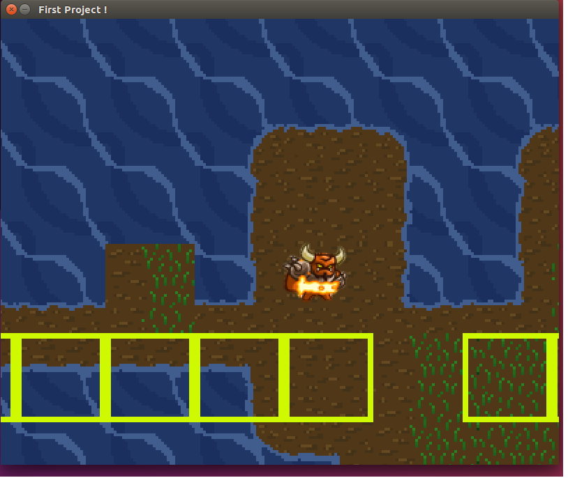

# GameEngine
---
A game engine with sdl and c++  
Currently there is basic RPG like game for testing   

Work In Progress!!!  
This is an old project, it will be refactored soon  

ECS design idea from : https://www.youtube.com/watch?v=44tO977slsU   

TODO
---
Refactor and Clean Code  
Write readme(Introduction, Usage, Testing, Installing, ...) 
Add c++20  
Write CMake  
Split code between files  
Add comments whenever needed  
add tests  
create library and split example from it  
improve runner  
add more features to ECS 